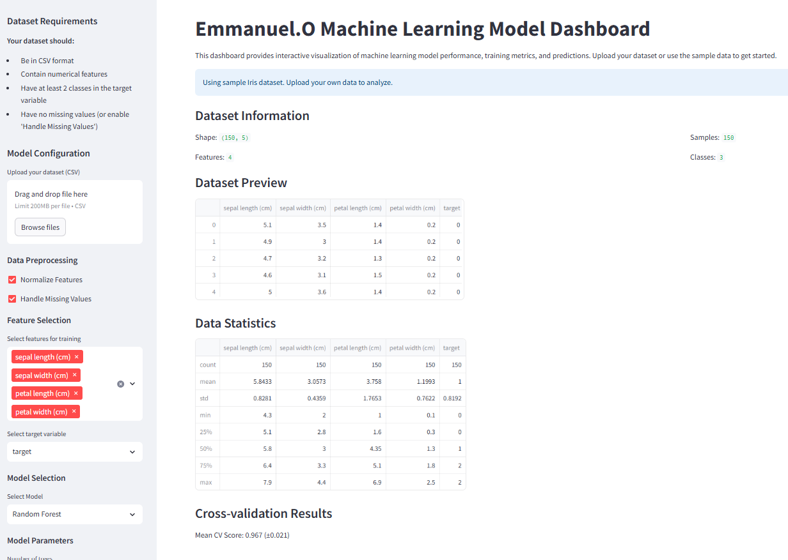

# Machine Learning Model Dashboard


A comprehensive, interactive dashboard for machine learning model development, evaluation, and deployment. Built with Streamlit and scikit-learn, this application provides a user-friendly interface for data scientists and machine learning practitioners.

## 📸 Screenshots


*Interactive machine learning dashboard showing model performance metrics and visualizations*

## 🚀 Features

### Data Management
- 📊 Upload custom CSV datasets
- 🔍 Interactive data exploration
- 🧹 Automatic data preprocessing
  - Missing value handling
  - Feature normalization
  - Non-numeric column detection

### Model Development
- 🤖 Multiple model support:
  - Random Forest
  - Gradient Boosting
  - Logistic Regression
  - Support Vector Machines
- ⚙️ Hyperparameter tuning
- 📈 Cross-validation
- 🎯 Model performance metrics

### Visualization
- 📉 Learning curves
- 🔍 Feature importance plots
- 📊 Confusion matrices
- 📈 ROC curves (for binary classification)
- 📊 Interactive plots with Plotly

### Deployment
- 💾 Model saving
- 📤 Results export
- 🔮 Real-time predictions

## 📋 Requirements

- Python 3.8+
- Streamlit 1.32.0
- scikit-learn 1.4.0
- Pandas 2.2.0
- NumPy 1.26.3
- Plotly 5.18.0
- Joblib 1.3.2
- Seaborn 0.13.2
- Matplotlib 3.8.3

## 🛠️ Installation

1. Clone the repository:
```bash
git clone https://github.com/yourusername/machine_learning_dashboard.git
cd machine_learning_dashboard
```

2. Create and activate a virtual environment:
```bash
python -m venv .venv
source .venv/bin/activate  # On Windows: .venv\Scripts\activate
```

3. Install dependencies:
```bash
pip install -r requirements.txt
```

## 🚀 Usage

1. Start the dashboard:
```bash
streamlit run app.py
```

2. Access the dashboard:
- Local URL: http://localhost:8501
- Network URL: http://your-ip:8501

3. Upload your dataset or use the sample Iris dataset

4. Configure model parameters and preprocessing options

5. Analyze results and export as needed

## 📊 Dataset Requirements

Your dataset should:
- Be in CSV format
- Contain numerical features
- Have at least 2 classes in the target variable
- Have no missing values (or enable 'Handle Missing Values')

## 📈 Model Evaluation Metrics

- Accuracy
- Cross-validation scores
- Classification report
- Feature importance
- Confusion matrix
- ROC curve (for binary classification)

## 🤝 Contributing

Contributions are welcome! Please feel free to submit a Pull Request.

1. Fork the repository
2. Create your feature branch (`git checkout -b feature/AmazingFeature`)
3. Commit your changes (`git commit -m 'Add some AmazingFeature'`)
4. Push to the branch (`git push origin feature/AmazingFeature`)
5. Open a Pull Request

## 📝 License

This project is licensed under the MIT License - see the [LICENSE](LICENSE) file for details.

## 🙏 Acknowledgments

- [Streamlit](https://streamlit.io/) for the web framework
- [scikit-learn](https://scikit-learn.org/) for machine learning capabilities
- [Plotly](https://plotly.com/) for interactive visualizations

## 📞 Support

For support, please open an issue in the GitHub repository or contact the maintainers.

---

Made with ❤️ by [Emmanuel.O] 